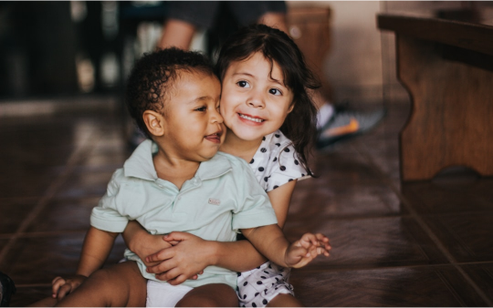

# Kids School Website

A responsive and colorful website designed for a kids’ school, showcasing curriculum, stories, and contact information. Perfect for schools, kindergartens, and educational institutions targeting young children.

## Demo

> **Live Preview:**  
> (https://israt-tarifa.github.io/-Pro-h2/)

## Features

- **Responsive Navigation Bar** – Home, About, Facilities, Admission, Contact
- **Banner Section** – Hero image with motivational tagline and call-to-action button
- **Standard Curriculum** – Sections for Kinder, Elementary, and Middle School
- **Stories / Blog Section** – Highlighting school events, workshops, and news
- **Footer** – Contact information, social media links, and about school

## Screenshots

## Technologies Used

- **HTML5** – Structure of the website
- **CSS3** – Styling with custom CSS
- **Responsive Design** – Mobile-friendly layout
- *(Optional: Add JavaScript for interactive features)*

## Folder Structure
